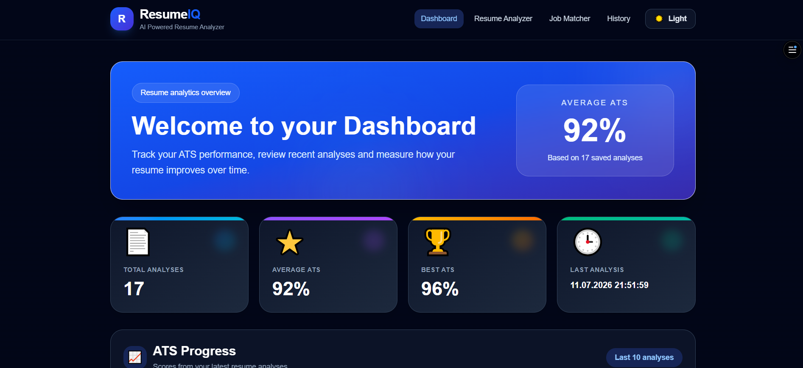
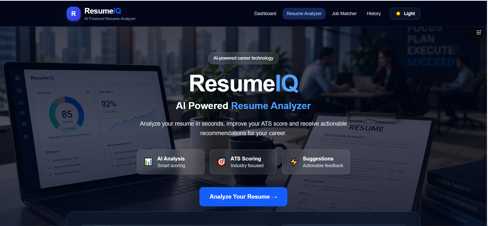
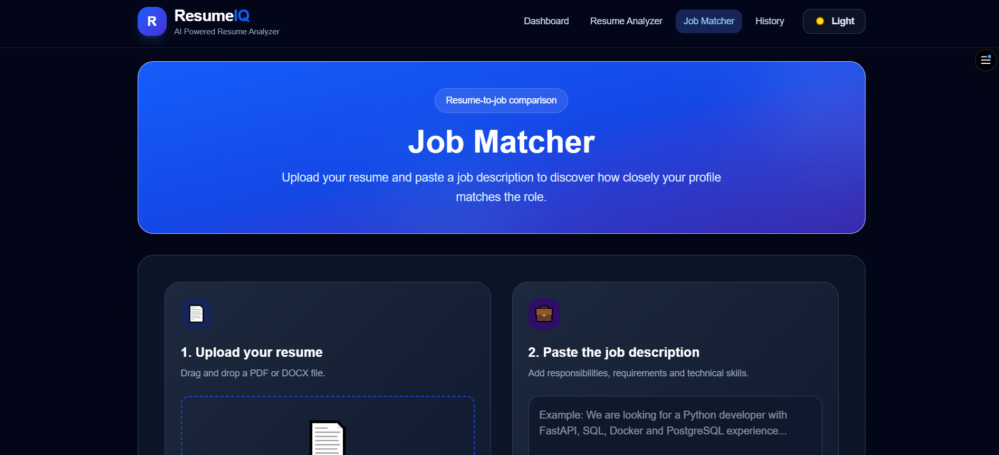
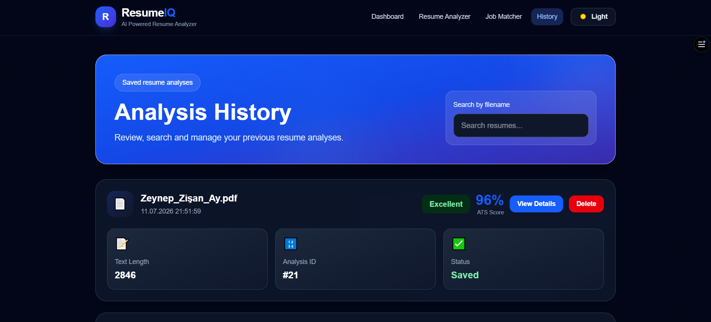

# 🚀 ResumeIQ


> **AI-powered Resume Analyzer** built with **React**, **FastAPI**, and **Python**.

ResumeIQ helps job seekers analyze resumes, calculate ATS scores, detect technical skills, compare resumes with job descriptions, and receive actionable recommendations for improvement.

---

# 🌐 Live Demo

**Frontend**

https://resumeiq-mu.vercel.app

**Backend API**

https://resumeiq-5e2z.onrender.com

**API Documentation**

https://resumeiq-5e2z.onrender.com/docs

> ⚠️ The backend runs on Render's free plan, so the first request may take **30–60 seconds** while the server wakes up.

---

# 📸 Screenshots

## 📊 Dashboard



---

## 📄 Resume Analyzer



---

## 💼 Job Matcher



---

## 📚 Analysis History



---

# ✨ Features

- 📄 Upload PDF & DOCX resumes
- 🎯 ATS Score Calculation
- 🤖 AI Resume Analysis
- 🧠 Technical Skill Detection
- ⭐ Suggested Skills
- 💡 Resume Improvement Recommendations
- 📊 Interactive Dashboard
- 💼 Resume & Job Description Matching
- 📈 Match Percentage
- 📂 Analysis History
- 🔍 Search Previous Analyses
- 🗑 Delete Saved Analyses
- 📥 Download PDF Report
- 🌙 Dark & Light Mode
- 📱 Fully Responsive Design
- 📂 Drag & Drop Upload

---

# 🛠 Tech Stack

### Frontend

- React
- Vite
- Tailwind CSS
- React Router
- Axios
- Recharts
- jsPDF
- html2canvas

### Backend

- Python
- FastAPI
- SQLAlchemy
- SQLite
- spaCy
- PyPDF
- python-docx
- Uvicorn

### Deployment

- Vercel
- Render
- GitHub

---

# 📄 Application Pages

### Resume Analyzer

- ATS Score
- Technical Skills
- Suggested Skills
- Resume Feedback
- Improvement Recommendations
- PDF Report Export

### Job Matcher

- Match Percentage
- Matched Skills
- Missing Skills
- Personalized Recommendations

### Dashboard

- Total Analyses
- Average ATS Score
- Best ATS Score
- ATS Analytics
- Recent Analyses

### Analysis History

- Search Analyses
- View Details
- Delete Analyses
- Review Previous Scores

---

# ⚙️ Run Locally

## Backend

```bash
cd backend
pip install -r requirements.txt
python -m uvicorn app.main:app --reload
```

Backend:

```
http://127.0.0.1:8000
```

Swagger UI:

```
http://127.0.0.1:8000/docs
```

## Frontend

```bash
cd frontend
npm install
npm run dev
```

Frontend:

```
http://localhost:5173
```

---

# 🔮 Future Improvements

- User Authentication
- PostgreSQL Integration
- AI Resume Rewriter
- OpenAI Resume Suggestions
- Cover Letter Generator
- Multi-language Support
- Cloud Storage
- Recruiter Dashboard

---

# 👩‍💻 Author

**Zeynep Zişan Ay**

- GitHub: https://github.com/zisanayy
- LinkedIn: https://www.linkedin.com/in/zeynep-zi%C5%9Fan-ay-5b8918313/

---

⭐ If you found this project helpful, consider giving it a **Star** on GitHub.

Built with ❤️ using **React**, **FastAPI**, and **Python**.